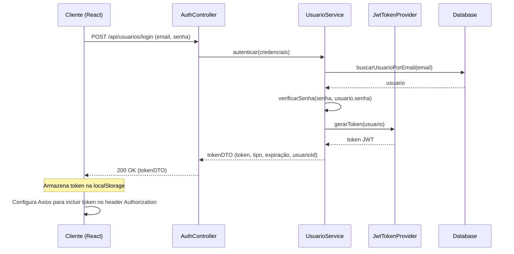
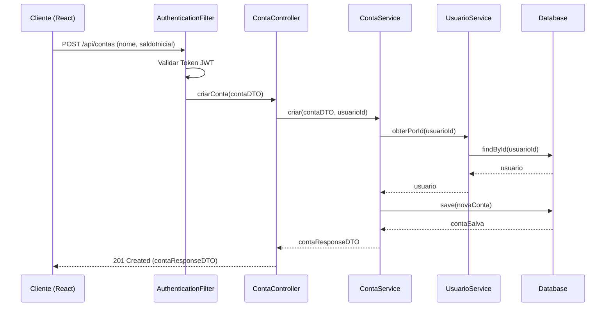
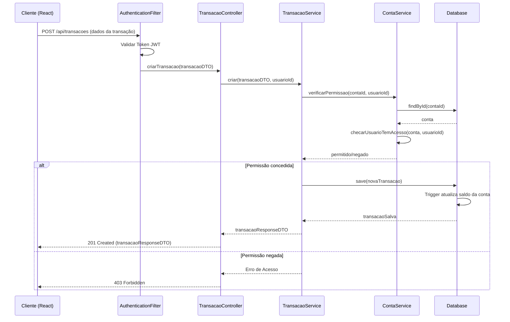
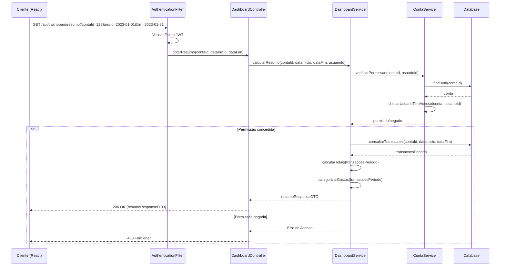

# Sistema de Controle Financeiro para Casais - Arquitetura

## Implementação de Abordagem

Para implementar o Sistema de Controle Financeiro para Casais, utilizaremos uma arquitetura cliente-servidor com os seguintes componentes principais:

1. **Frontend**: Aplicação React (CRA) para interface do usuário
2. **Backend**: API REST com Spring Boot
3. **Banco de dados**: PostgreSQL via Supabase

Dificuldades técnicas identificadas e soluções propostas:

1. **Compartilhamento de dados entre usuários**: Implementaremos um sistema de contas compartilhadas onde dois usuários terão acesso aos mesmos dados financeiros.
   - Solução: Utilização de Row Level Security (RLS) no Supabase para controlar o acesso.

2. **Autenticação e autorização**: Garantir que apenas usuários autorizados acessem os dados.
   - Solução: JWT para autenticação entre frontend e backend, integrado com Spring Security.

3. **Cálculos financeiros em tempo real**: Saldos e relatórios precisam ser atualizados automaticamente.
   - Solução: Triggers no banco de dados para cálculos automáticos e WebSockets para atualizações em tempo real.

4. **Visualização de dados**: Exibir informações financeiras de forma clara e útil.
   - Solução: Uso de Chart.js para gráficos e dashboards personalizados.

### Principais Bibliotecas/Frameworks

#### Frontend
- React 18.x (Create React App)
- React Router para navegação
- Axios para requisições HTTP
- Chart.js para visualizações gráficas
- React Hook Form para formulários
- Tailwind CSS para estilização

#### Backend
- Spring Boot 3.2.3
- Spring Security com JWT
- Spring Data JPA
- PostgreSQL Driver
- ModelMapper para conversão DTO
- Lombok para redução de código boilerplate

## Estrutura de Dados e Interfaces

A estrutura de dados será modelada conforme o seguinte diagrama de classes:

### Diagrama de Classes

```mermaid
classDiagram
    class Usuario {
        -UUID id
        -String nome
        -String sobrenome
        -String email
        -String avatarUrl
        -LocalDateTime dataCriacao
        -LocalDateTime ultimaAtualizacao
        +registrar(UsuarioDTO)
        +atualizar(UUID, UsuarioDTO)
        +obterPerfil(UUID)
    }

    class Conta {
        -UUID id
        -String nome
        -BigDecimal saldoInicial
        -BigDecimal saldoAtual
        -UUID usuario1Id
        -UUID usuario2Id
        -LocalDateTime dataCriacao
        -LocalDateTime ultimaAtualizacao
        +criar(ContaDTO)
        +atualizar(UUID, ContaDTO)
        +obterDetalhe(UUID)
        +obterSaldo(UUID)
        +listarContasDoUsuario(UUID)
        +adicionarParceiro(UUID, UUID)
    }

    class Transacao {
        -UUID id
        -String descricao
        -BigDecimal valor
        -LocalDate data
        -TipoTransacao tipo
        -String categoria
        -UUID contaId
        -UUID usuarioId
        -LocalDateTime dataCriacao
        -LocalDateTime ultimaAtualizacao
        +criar(TransacaoDTO)
        +atualizar(UUID, TransacaoDTO)
        +remover(UUID)
        +listar(UUID, Filtros)
        +obterDetalhe(UUID)
    }

    class TipoTransacao {
        <<enumeration>>
        ENTRADA
        SAIDA
    }

    class ResumoPeriodo {
        -UUID contaId
        -LocalDate dataInicio
        -LocalDate dataFim
        -BigDecimal totalEntradas
        -BigDecimal totalSaidas
        -BigDecimal saldoPeriodo
        -Map~String, BigDecimal~ gastosPorCategoria
        +calcular(UUID, LocalDate, LocalDate)
    }

    class FiltroTransacao {
        -LocalDate dataInicio
        -LocalDate dataFim
        -TipoTransacao tipo
        -String categoria
        -UUID usuarioId
        -String orderBy
        -Boolean orderDesc
    }

    class UsuarioController {
        -UsuarioService usuarioService
        +registrar(UsuarioDTO)
        +login(CredenciaisDTO)
        +obterPerfil()
        +atualizarPerfil(UsuarioDTO)
    }

    class ContaController {
        -ContaService contaService
        +criarConta(ContaDTO)
        +listarContas()
        +obterConta(UUID)
        +atualizarConta(UUID, ContaDTO)
        +adicionarParceiro(UUID, EmailDTO)
    }

    class TransacaoController {
        -TransacaoService transacaoService
        +criarTransacao(TransacaoDTO)
        +listarTransacoes(UUID, FiltroTransacao)
        +obterTransacao(UUID)
        +atualizarTransacao(UUID, TransacaoDTO)
        +removerTransacao(UUID)
    }

    class DashboardController {
        -DashboardService dashboardService
        +obterResumo(UUID, LocalDate, LocalDate)
        +obterGraficoCategoria(UUID, LocalDate, LocalDate)
        +obterGraficoEvolucao(UUID, LocalDate, LocalDate)
    }

    class UsuarioService {
        -UsuarioRepository usuarioRepository
        -PasswordEncoder passwordEncoder
        -JwtTokenProvider tokenProvider
        +registrar(UsuarioDTO)
        +autenticar(CredenciaisDTO)
        +obterPorId(UUID)
        +atualizar(UUID, UsuarioDTO)
        +verificarEmail(String)
    }

    class ContaService {
        -ContaRepository contaRepository
        -UsuarioRepository usuarioRepository
        +criar(ContaDTO, UUID)
        +atualizar(UUID, ContaDTO, UUID)
        +obterPorId(UUID, UUID)
        +listarContasDoUsuario(UUID)
        +adicionarParceiro(UUID, String, UUID)
        +verificarPermissao(UUID, UUID)
    }

    class TransacaoService {
        -TransacaoRepository transacaoRepository
        -ContaService contaService
        +criar(TransacaoDTO, UUID)
        +atualizar(UUID, TransacaoDTO, UUID)
        +remover(UUID, UUID)
        +listarPorConta(UUID, FiltroTransacao, UUID)
        +obterPorId(UUID, UUID)
    }

    class DashboardService {
        -TransacaoRepository transacaoRepository
        -ContaService contaService
        +calcularResumo(UUID, LocalDate, LocalDate, UUID)
        +calcularGastosPorCategoria(UUID, LocalDate, LocalDate, UUID)
        +calcularEvolucaoSaldo(UUID, LocalDate, LocalDate, UUID)
    }

    class JwtTokenProvider {
        -String chaveSecreta
        -long validade
        +gerarToken(Authentication)
        +obterIdUsuario(String)
        +validarToken(String)
    }
    
    class AuthenticationFilter {
        -JwtTokenProvider tokenProvider
        -UserDetailsService userDetailsService
        +doFilterInternal(HttpServletRequest, HttpServletResponse, FilterChain)
    }

    Usuario --o Transacao : registra
    Usuario "1" --o "*" Conta : possui
    Conta "1" --o "*" Transacao : contém
    Transacao -- TipoTransacao : é do tipo
    
    ResumoPeriodo --> Conta : calcula para
    FiltroTransacao --> Transacao : filtra
    
    UsuarioController --> UsuarioService : usa
    ContaController --> ContaService : usa
    TransacaoController --> TransacaoService : usa
    DashboardController --> DashboardService : usa
    
    UsuarioService --> JwtTokenProvider : usa
    AuthenticationFilter --> JwtTokenProvider : usa
    TransacaoService --> ContaService : usa
    DashboardService --> ContaService : usa
```



### APIs e Interfaces do Sistema

#### API de Usuários
- POST /api/usuarios/registro: Registrar novo usuário
- POST /api/usuarios/login: Autenticar usuário
- GET /api/usuarios/perfil: Obter perfil do usuário autenticado
- PUT /api/usuarios/perfil: Atualizar perfil do usuário

#### API de Contas
- POST /api/contas: Criar nova conta
- GET /api/contas: Listar todas as contas do usuário
- GET /api/contas/{id}: Obter detalhes de uma conta
- PUT /api/contas/{id}: Atualizar conta
- POST /api/contas/{id}/parceiro: Adicionar parceiro à conta

#### API de Transações
- POST /api/transacoes: Criar nova transação
- GET /api/transacoes?contaId={id}&filtros...: Listar transações
- GET /api/transacoes/{id}: Obter detalhes de uma transação
- PUT /api/transacoes/{id}: Atualizar transação
- DELETE /api/transacoes/{id}: Remover transação

#### API de Dashboard
- GET /api/dashboard/resumo?contaId={id}&inicio={data}&fim={data}: Obter resumo financeiro
- GET /api/dashboard/grafico/categoria?contaId={id}&inicio={data}&fim={data}: Dados para gráfico de categorias
- GET /api/dashboard/grafico/evolucao?contaId={id}&inicio={data}&fim={data}: Dados para gráfico de evolução

## Fluxo de Execução do Programa

Abaixo estão os principais fluxos de execução do sistema:

### Fluxo de Autenticação



### Fluxo de Criação de Conta Compartilhada



### Fluxo de Registro de Transação



### Fluxo de Visualização de Dashboard



## Aspectos Adicionais

### Estrutura de Pastas Frontend (React)

```
frontend/
├── public/
├── src/
│   ├── assets/
│   │   ├── images/
│   │   └── styles/
│   ├── components/
│   │   ├── auth/
│   │   │   ├── Login.jsx
│   │   │   └── Register.jsx
│   │   ├── dashboard/
│   │   │   ├── BalanceCard.jsx
│   │   │   ├── CategoryChart.jsx
│   │   │   ├── Dashboard.jsx
│   │   │   ├── IncomeExpenseCard.jsx
│   │   │   └── TransactionsList.jsx
│   │   ├── layout/
│   │   │   ├── Header.jsx
│   │   │   ├── Footer.jsx
│   │   │   ├── Sidebar.jsx
│   │   │   └── Layout.jsx
│   │   ├── transaction/
│   │   │   ├── TransactionForm.jsx
│   │   │   └── TransactionItem.jsx
│   │   └── shared/
│   │       ├── Button.jsx
│   │       ├── Input.jsx
│   │       ├── Modal.jsx
│   │       └── Alert.jsx
│   ├── contexts/
│   │   ├── AuthContext.jsx
│   │   └── TransactionContext.jsx
│   ├── hooks/
│   │   ├── useAuth.js
│   │   └── useTransactions.js
│   ├── pages/
│   │   ├── DashboardPage.jsx
│   │   ├── LoginPage.jsx
│   │   ├── RegisterPage.jsx
│   │   ├── AccountsPage.jsx
│   │   ├── TransactionsPage.jsx
│   │   └── ProfilePage.jsx
│   ├── services/
│   │   ├── api.js
│   │   ├── authService.js
│   │   ├── transactionService.js
│   │   ├── accountService.js
│   │   └── dashboardService.js
│   ├── utils/
│   │   ├── formatters.js
│   │   ├── validators.js
│   │   └── constants.js
│   ├── App.jsx
│   ├── index.js
│   └── routes.js
├── package.json
└── tailwind.config.js
```

### Estrutura de Pastas Backend (Spring Boot)

```
backend/
├── src/
│   ├── main/
│   │   ├── java/
│   │   │   └── com/
│   │   │       └── financeiro/
│   │   │           └── casal/
│   │   │               ├── config/
│   │   │               │   ├── SecurityConfig.java
│   │   │               │   ├── JwtConfig.java
│   │   │               │   └── WebConfig.java
│   │   │               ├── controller/
│   │   │               │   ├── UsuarioController.java
│   │   │               │   ├── ContaController.java
│   │   │               │   ├── TransacaoController.java
│   │   │               │   └── DashboardController.java
│   │   │               ├── dto/
│   │   │               │   ├── request/
│   │   │               │   │   ├── UsuarioDTO.java
│   │   │               │   │   ├── ContaDTO.java
│   │   │               │   │   ├── TransacaoDTO.java
│   │   │               │   │   └── CredenciaisDTO.java
│   │   │               │   └── response/
│   │   │               │       ├── UsuarioResponseDTO.java
│   │   │               │       ├── ContaResponseDTO.java
│   │   │               │       ├── TransacaoResponseDTO.java
│   │   │               │       ├── TokenDTO.java
│   │   │               │       └── ResumoResponseDTO.java
│   │   │               ├── exception/
│   │   │               │   ├── ApiExceptionHandler.java
│   │   │               │   ├── ResourceNotFoundException.java
│   │   │               │   ├── AccessDeniedException.java
│   │   │               │   └── BusinessException.java
│   │   │               ├── model/
│   │   │               │   ├── Usuario.java
│   │   │               │   ├── Conta.java
│   │   │               │   ├── Transacao.java
│   │   │               │   └── enums/
│   │   │               │       └── TipoTransacao.java
│   │   │               ├── repository/
│   │   │               │   ├── UsuarioRepository.java
│   │   │               │   ├── ContaRepository.java
│   │   │               │   └── TransacaoRepository.java
│   │   │               ├── security/
│   │   │               │   ├── JwtTokenProvider.java
│   │   │               │   ├── JwtAuthenticationFilter.java
│   │   │               │   └── UserDetailsServiceImpl.java
│   │   │               ├── service/
│   │   │               │   ├── UsuarioService.java
│   │   │               │   ├── ContaService.java
│   │   │               │   ├── TransacaoService.java
│   │   │               │   └── DashboardService.java
│   │   │               └── SistemaFinanceiroApplication.java
│   │   └── resources/
│   │       ├── application.properties
│   │       └── schema.sql
│   └── test/
│       └── java/
│           └── com/
│               └── financeiro/
│                   └── casal/
│                       ├── controller/
│                       ├── service/
│                       └── repository/
├── mvnw
├── mvnw.cmd
└── pom.xml
```

### Considerações de Segurança

1. **Autenticação e Autorização**:
   - Uso de JWT para autenticação stateless
   - Spring Security para proteção de endpoints
   - Tokens com expiração configurável
   - Row Level Security no Supabase para controle de acesso aos dados

2. **Proteção de Dados**:
   - Senhas armazenadas com hash BCrypt
   - HTTPS obrigatório em produção
   - Validação de entrada para prevenção de ataques de injeção
   - Sanitização de dados

3. **Cross-Site Scripting (XSS) e CSRF**:
   - Validação de entradas no frontend e backend
   - Sanitização de dados antes de renderizar no frontend
   - Proteção CSRF para formulários importantes
   - Content Security Policy (CSP) configurado

### Considerações sobre Banco de Dados

1. **Triggers para cálculos automáticos**:
   - Atualização automática do saldo da conta quando há alterações nas transações
   - Funções para cálculo de resumos por categoria

2. **Índices para otimização**:
   - Índices em campos frequentemente consultados (conta_id, data, categoria)
   - Índices em chaves estrangeiras

3. **Row Level Security (RLS)**:
   - Políticas de segurança por linha para garantir que usuários acessem apenas seus próprios dados
   - Regras específicas para contas compartilhadas

## Aspectos Não Claros

1. **Integração com outros sistemas financeiros**: O escopo inicial não contempla integrações com bancos ou APIs financeiras externas. A inclusão dessas integrações exigiria uma revisão da arquitetura.

2. **Metas financeiras e orçamentos**: O sistema atual tem foco em registro e visualização de transações. A implementação de metas e orçamentos seria uma extensão natural para versões futuras.

3. **Notificações**: Um sistema de notificações (e-mail, push) para alertas de gastos ou lembretes pode ser adicionado em versões futuras.

4. **Multi-dispositivo**: A sincronização em tempo real entre múltiplos dispositivos seria um ponto a considerar para implementação futura, possivelmente utilizando WebSockets ou Supabase Realtime.