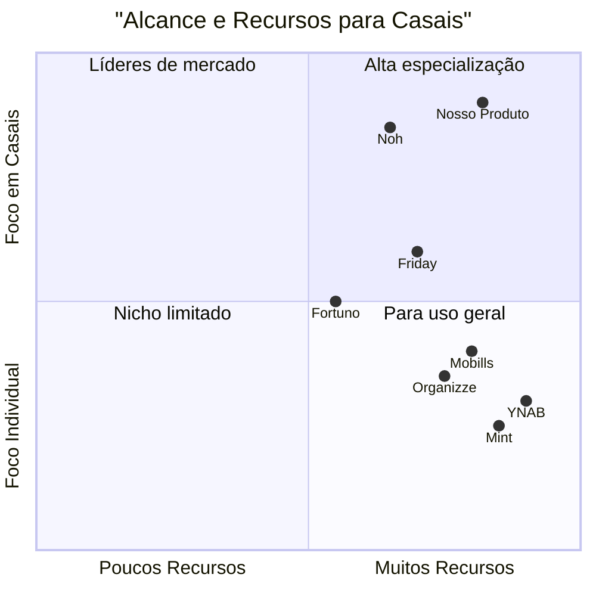

# PRD: Sistema de Controle Financeiro para Casais

## 1. Visão Geral do Produto

### 1.1 Introdução

O Sistema de Controle Financeiro para Casais é uma aplicação web desenvolvida para permitir que casais gerenciem suas finanças de forma compartilhada. O sistema facilita o registro, categorização e acompanhamento de transações financeiras, oferecendo uma visão clara da saúde financeira do casal através de dashboards intuitivos e relatórios detalhados.

### 1.2 Requisitos Originais

Vamos criar um Sistema de Controle Financeiro para Casais usando React (CRA) para o frontend e Spring Boot para o backend. O sistema permitirá que casais gerenciem suas finanças compartilhadas, incluindo registro de transações (entradas e saídas), categorização, visualização de saldo e relatórios financeiros. As pastas devem ser nomeadas como 'frontend' e 'backend', e o sistema utilizará PostgreSQL/Supabase para o banco de dados.

### 1.3 Tecnologias Escolhidas

#### Frontend:
- React (Create React App)
- TypeScript
- Bootstrap ou Material UI para componentes visuais
- Chart.js para visualização de dados
- Axios para requisições HTTP

#### Backend:
- Java 17
- Spring Boot 3.2.3
- Spring Security com JWT
- Spring Data JPA
- Lombok para redução de boilerplate

#### Banco de Dados:
- PostgreSQL via Supabase

## 2. Definição do Produto

### 2.1 Objetivos do Produto

1. **Transparência Financeira**: Proporcionar uma visão clara e compartilhada das finanças do casal, promovendo transparência e confiança.

2. **Simplificação do Gerenciamento Financeiro**: Facilitar o controle de entradas, saídas e orçamentos compartilhados, reduzindo o esforço necessário para manter as finanças organizadas.

3. **Tomada de Decisão Colaborativa**: Fornecer dados e insights que auxiliem os casais a tomarem decisões financeiras informadas e alinhadas com seus objetivos comuns.

### 2.2 Histórias de Usuário

1. **Como um casal**, queremos criar uma conta compartilhada, para que possamos gerenciar nossas finanças juntos em um único lugar.

2. **Como um usuário**, quero registrar transações financeiras (entradas e saídas) e categorizá-las, para que eu possa acompanhar nossos gastos e receitas.

3. **Como um usuário**, quero visualizar um dashboard com resumo financeiro, para que eu possa ter uma visão geral da nossa saúde financeira.

4. **Como um casal**, queremos definir orçamentos para diferentes categorias, para que possamos controlar melhor nossos gastos.

5. **Como um usuário**, quero gerar relatórios financeiros por período e categoria, para que possamos analisar nossos hábitos financeiros e planejar melhorias.

### 2.3 Análise Competitiva

| Aplicativo | Pontos Fortes | Pontos Fracos |
|------------|---------------|---------------|
| **Noh** | Conta conjunta digital específica para casais; Pagamentos via Pix, boleto e cartão pré-pago; Notificações em tempo real | Interface limitada para análises detalhadas; Menos recursos de planejamento financeiro |
| **Friday** | Automatiza organização e pagamentos; Unificação de contas de diferentes CPFs; Alertas via WhatsApp | Foco mais em pagamentos que em análise financeira completa; Menos recursos para definição de metas |
| **Mobills** | Categorização detalhada; Sincronização na nuvem; Planejamento com metas | Não é especificamente desenhado para casais; Curva de aprendizado mais íngreme |
| **Organizze** | Interface intuitiva; Orçamento mensal; Relatórios claros | Funcionalidades para casais limitadas; Menos recursos de colaboração |
| **Fortuno** | Controle de cartões de crédito; Personalização de categorias para casais | Menos recursos avançados; Interface menos moderna |
| **YNAB** | Metodologia financeira robusta; Educação financeira integrada | Preço elevado; Não é localizado para o Brasil |
| **Mint** | Integração com contas bancárias; Alertas personalizados | Não disponível no Brasil; Não é focado em casais |

### 2.4 Quadrante Competitivo



## 3. Especificações Técnicas

### 3.1 Análise de Requisitos

#### 3.1.1 Requisitos Funcionais

1. **Autenticação e Autorização**
   - Registro de usuários com email e senha
   - Login seguro com JWT
   - Convite para parceiro e criação de conta compartilhada
   - Gerenciamento de permissões por conta

2. **Gerenciamento de Transações**
   - Cadastro de transações (entradas/saídas)
   - Categorização de transações
   - Edição e exclusão de transações
   - Filtros por data, categoria, tipo e membro

3. **Dashboard Financeiro**
   - Visão geral de saldo atual
   - Gráfico de entradas vs saídas
   - Distribuição de gastos por categoria
   - Evolução do saldo ao longo do tempo

4. **Orçamentos**
   - Definição de orçamentos por categoria
   - Acompanhamento de orçamentos
   - Alertas de limite de orçamento

5. **Relatórios**
   - Relatórios por período
   - Relatórios por categoria
   - Exportação em PDF/CSV

6. **Gestão de Contas**
   - Criação de contas compartilhadas
   - Gerenciamento de membros da conta
   - Configurações de conta

#### 3.1.2 Requisitos Não-Funcionais

1. **Segurança**
   - Proteção de dados sensíveis com criptografia
   - Autenticação segura com JWT
   - Autorização baseada em papéis
   - Proteção contra ataques CSRF, XSS e injeção SQL

2. **Performance**
   - Tempo de resposta máximo de 2 segundos
   - Suporte a pelo menos 1000 usuários simultâneos
   - Otimização de consultas ao banco de dados

3. **Usabilidade**
   - Interface responsiva (desktop e mobile)
   - Design intuitivo para ambos os parceiros
   - Feedback visual para ações do usuário

4. **Disponibilidade**
   - Tempo de atividade de 99.9%
   - Backup diário dos dados

5. **Escalabilidade**
   - Arquitetura que permite crescimento horizontal
   - Divisão em microserviços quando necessário

### 3.2 Pool de Requisitos

#### P0 (Must Have)
- Sistema de autenticação e autorização seguro
- CRUD de transações financeiras
- Categorização de transações
- Dashboard básico com saldo e gráficos
- Criação de contas compartilhadas
- Convite para parceiro
- Filtros básicos de transações

#### P1 (Should Have)
- Sistema de orçamentos por categoria
- Relatórios financeiros básicos
- Exportação de dados
- Notificações de limite de orçamento
- Perfis de usuário
- Histórico de atividades

#### P2 (Nice to Have)
- Metas financeiras compartilhadas
- Integração com bancos via Open Banking
- Análise preditiva de gastos
- Recomendações personalizadas
- Aplicativo mobile
- Chat interno para discussão de finanças

### 3.3 Arquitetura do Sistema

#### 3.3.1 Diagrama de Arquitetura

O sistema seguirá uma arquitetura cliente-servidor tradicional com separação clara entre frontend e backend:

- **Frontend**: Aplicação SPA React hospedada em serviço de hospedagem estática
- **Backend**: API RESTful Spring Boot hospedada em serviço de nuvem
- **Banco de Dados**: PostgreSQL gerenciado pelo Supabase
- **Autenticação**: Sistema JWT integrado com Supabase Auth

#### 3.3.2 Modelo de Dados

**Tabelas Principais:**

1. **usuarios**
   - id (UUID, PK)
   - nome (VARCHAR)
   - sobrenome (VARCHAR)
   - email (VARCHAR, único)
   - avatar_url (TEXT)
   - data_criacao (TIMESTAMP)
   - ultima_atualizacao (TIMESTAMP)

2. **contas**
   - id (UUID, PK)
   - nome (VARCHAR)
   - saldo_inicial (DECIMAL)
   - saldo_atual (DECIMAL)
   - usuario1_id (UUID, FK)
   - usuario2_id (UUID, FK, opcional)
   - data_criacao (TIMESTAMP)
   - ultima_atualizacao (TIMESTAMP)

3. **transacoes**
   - id (UUID, PK)
   - descricao (VARCHAR)
   - valor (DECIMAL)
   - data (DATE)
   - tipo (ENUM: 'ENTRADA', 'SAIDA')
   - categoria (VARCHAR)
   - conta_id (UUID, FK)
   - usuario_id (UUID, FK)
   - data_criacao (TIMESTAMP)
   - ultima_atualizacao (TIMESTAMP)

4. **categorias**
   - id (UUID, PK)
   - nome (VARCHAR)
   - tipo (ENUM: 'ENTRADA', 'SAIDA', 'AMBOS')
   - icone (VARCHAR)
   - cor (VARCHAR)
   - conta_id (UUID, FK)
   - padrao (BOOLEAN)

5. **orcamentos**
   - id (UUID, PK)
   - categoria_id (UUID, FK)
   - conta_id (UUID, FK)
   - valor (DECIMAL)
   - mes (INTEGER)
   - ano (INTEGER)

### 3.4 Interfaces de Usuário

#### 3.4.1 Design do Dashboard Principal

O dashboard principal apresentará:

- Cabeçalho com logo, nome do sistema e informações do usuário
- Menu lateral com acesso às principais funcionalidades
- Área central com widgets:
  - Saldo atual
  - Gráfico de entradas e saídas do mês
  - Distribuição de gastos por categoria (gráfico de pizza)
  - Lista de transações recentes

#### 3.4.2 Fluxo de Cadastro de Transações

1. Usuário clica em "Nova Transação"
2. Modal é exibido com formulário contendo:
   - Tipo (Entrada/Saída)
   - Valor
   - Data
   - Descrição
   - Categoria (dropdown)
   - Botões de Cancelar/Salvar
3. Após salvar, o dashboard é atualizado automaticamente

#### 3.4.3 Fluxo de Criação de Conta Compartilhada

1. Usuário se registra no sistema
2. Cria uma nova conta com nome e saldo inicial
3. Convida parceiro via email
4. Parceiro recebe email com link de convite
5. Parceiro cria conta ou faz login se já tiver cadastro
6. Parceiro é adicionado à conta compartilhada

## 4. Implementação

### 4.1 Estrutura do Projeto

```
/sistema-financeiro-casal
  /frontend
    /public
    /src
      /assets
      /components
      /contexts
      /hooks
      /pages
      /services
      /utils
      App.tsx
      index.tsx
  /backend
    /src
      /main
        /java
          /com/financeiro/casal
            /config
            /controller
            /dto
            /exception
            /model
            /repository
            /security
            /service
            /util
            Application.java
        /resources
          application.properties
          schema.sql
      /test
    pom.xml
  README.md
```

### 4.2 Sequência de Implementação

1. **Fase 1 - Configuração e Autenticação**
   - Configuração do ambiente de desenvolvimento
   - Implementação do backend básico
   - Sistema de autenticação e autorização
   - Integração com Supabase

2. **Fase 2 - Funcionalidades Core**
   - CRUD de transações
   - Dashboard básico
   - Categorização
   - Criação de contas compartilhadas

3. **Fase 3 - Relatórios e Orçamentos**
   - Sistema de orçamentos
   - Relatórios financeiros
   - Notificações e alertas

4. **Fase 4 - Polimento e Recursos Adicionais**
   - Melhorias de UI/UX
   - Otimizações de performance
   - Funcionalidades P2 (se houver tempo)

## 5. Considerações Finais

### 5.1 Medidas de Segurança

- **Proteção de Dados**: Implementação de criptografia para dados sensíveis
- **Autenticação Segura**: JWT com refresh tokens e expiração adequada
- **Autorização**: Verificações de permissão em todas as operações
- **HTTPS**: Configuração obrigatória de SSL
- **Validação de Entrada**: Sanitização de todos os inputs
- **Proteção contra Ataques**: Configuração para prevenir CSRF, XSS e injeção SQL

### 5.2 Perguntas em Aberto

1. Como será implementada a integração com instituições financeiras para importação automática de transações?
2. Qual será a estratégia de monetização do produto (freemium, assinatura, etc.)?
3. Como lidar com separações de casais em relação ao acesso aos dados históricos?
4. Quais métricas serão utilizadas para medir o sucesso do produto?
5. Qual será a estratégia de expansão para outros idiomas e regiões?

### 5.3 Próximas Etapas

1. Validação do PRD com stakeholders
2. Criação de protótipos de alta fidelidade
3. Definição de sprints e cronograma detalhado
4. Implementação da Fase 1
5. Testes com usuários reais

---

## Apêndices

### Apêndice A: Glossário

- **JWT**: JSON Web Token, método para transferir informações de autenticação de forma segura.
- **Supabase**: Plataforma de banco de dados e autenticação baseada em PostgreSQL.
- **CRUD**: Create, Read, Update, Delete - operações básicas de persistência.
- **Spring Boot**: Framework Java para criação de aplicações web.
- **React**: Biblioteca JavaScript para construção de interfaces de usuário.

### Apêndice B: Referências

1. Spring Boot Documentation: https://docs.spring.io/spring-boot/docs/current/reference/html/
2. React Documentation: https://reactjs.org/docs
3. Supabase Documentation: https://supabase.io/docs
4. JWT.io: https://jwt.io/introduction
